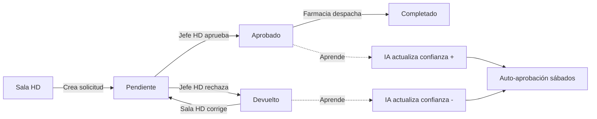
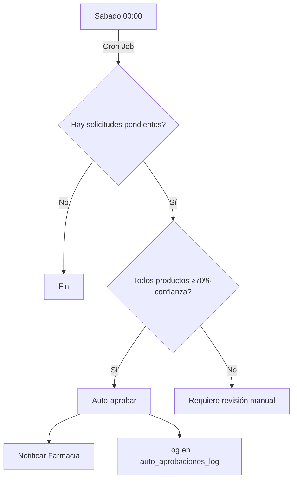

# DialyStock V4.0 🚀

**Sistema Inteligente de Gestión de Inventario para Unidades Renales**

[](https://github.com/madfer93/dialystock)
[](LICENSE)
[](https://nextjs.org/)
[](https://supabase.com/)

---

## 🎯 Descripción

DialyStock es la plataforma líder para el control inteligente de inventarios en clínicas de diálisis. Optimiza procesos de Hemodiálisis (HD) y Diálisis Peritoneal (PD) con **trazabilidad total** y **sistema de Inteligencia Artificial avanzado**.

### ✨ Características Principales

- 🧠 **IA Predictiva:** Alertas 7 días antes de agotamiento de stock
- 📊 **Dashboard en Tiempo Real:** KPIs y métricas automatizadas
- 🔄 **Rotación FEFO Inteligente:** Minimiza productos vencidos (-75%)
- 🤖 **Auto-aprobación Inteligente:** Sábados automatizados
- 📦 **Farmacia Premium:** Gestión completa de lotes y vencimientos
- 🔍 **Auditoría Total:** Trazabilidad completa de cada movimiento
- 📱 **Responsive:** Diseñado para desktop y tablets

---

## 🚀 Demo en Vivo

**Landing Page:** https://dialystock.vercel.app  
**Sistema (requiere auth):** https://dialystock.vercel.app/clinica

**Cuentas de prueba:**
- Admin: `admin@clinica.com` (gestión completa + IA)
- Farmacia: `farmacia@clinica.com` (despacho de insumos)
- Jefe HD: `jefehd@clinica.com` (aprobación solicitudes HD)
- Sala HD: `salahd@clinica.com` (solicitudes HD)

---

## 📦 Tech Stack

| Categoría | Tecnología |
|-----------|------------|
| **Framework** | Next.js 15.1 (App Router) |
| **Base de Datos** | Supabase (PostgreSQL) |
| **Autenticación** | Supabase Auth (Magic Links) |
| **Frontend** | React 19, TypeScript, TailwindCSS |
| **UI Components** | Lucide Icons, Recharts |
| **IA/Analytics** | PostgreSQL Functions, Custom Algorithms |
| **Deployment** | Vercel (production) |

---

##  Módulos del Sistema

### 1. 👨‍💼 Panel Admin (Clínica)

**Ruta:** `/clinica`

**Características:**
- 📊 Dashboard con KPIs operativos
- 👥 Gestión de usuarios y roles
- 📦 Inventario centralizado de productos
- 📅 Calendario de actividades
- 📜 Auditoría completa
- 🤖 **Dashboard IA Inteligente** (NUEVO)

**IA Intelligence Features:**
- KPIs Predictivos (4 cards con gradientes)
- Tabla de productos confiables (≥70% confianza)
- Sistema de aprendizaje automático
- Auto-aprobación configurada (sábados)
- Info cards de criterios y auditoría

---

### 2. 🏥 Sala HD (Hemodiálisis)

**Ruta:** `/sala-hd`

**Características:**
- ✅ Crear solicitudes de insumos HD
- 📋 Templates rápidos para turnos
- 📊 Historial de solicitudes
- 🔔 Notificaciones en tiempo real
- 📱 Interfaz optimizada para tablets

---

### 3. 💊 Sala PD (Diálisis Peritoneal)

**Ruta:** `/sala-pd`

**Características:**
- ✅ Solicitudes específicas PD
- 📦 Control de soluciones y catéteres
- 📋 Templates para procedimientos
- 📊 Historial y trazabilidad

---

### 4. 👔 Jefe HD

**Ruta:** `/jefe-hd`

**Características:**
- ✅ Aprobar/Rechazar solicitudes HD
- 📊 Dashboard de solicitudes pendientes
- 🤖 **Sistema de Aprendizaje IA:** Registra cada aprobación/rechazo
- 📈 Análisis de patrones de consumo
- 🔔 Alertas personalizadas

**IA Learning:**
- Cada aprobación aumenta confianza del producto
- Cada rechazo disminuye confianza
- Datos alimentan sistema de auto-aprobación

---

### 5. 👔 Jefe PD

**Ruta:** `/jefe-pd`

**Características:**
- ✅ Aprobar solicitudes PD
- 📊 Vista consolidada de peticiones
- 📈 Reportes de consumo PD

---

### 6. 💊 Farmacia

**Ruta:** `/farmacia`

**Características Core:**
- ✅ Despacho de solicitudes aprobadas
- 📦 Gestión de Productos y Lotes
- 📋 Autocomplete inteligente de lotes
- 🖨️ Impresión de solicitudes (logo DaVita)
- 📊 Control de vencimientos
- 🔔 Reportes de áreas

**IA Features (Integradas):**
- 🤖 **Alertas Predictivas:** 7 días antes de agotamiento
- ⚠️ **Detección de Anomalías:** Consumo anormal automático
- 📊 **Stock Mínimo Dinámico:** Auto-ajuste semanal
- 🔄 **Rotación FEFO Inteligente:** Sugiere lotes próximos a vencer
- 📋 **Recomendaciones de Compra:** Lista automática lunes

---

### 7. 🔧 SuperAdmin

**Ruta:** `/superadmin`

**Características:**
- 🏢 Gestión de clínicas (multi-tenant)
- 👥 Creación masiva de usuarios
- ⚙️ Configuración global
- 🔑 Control de API keys (Groq, Wompi)
- 📊 Analytics globales

---

## 🧠 Sistema de Inteligencia Artificial

### Arquitectura IA

```
┌─────────────────────────────────────────────────┐
│          CAPA DE APRENDIZAJE (Jefe HD)          │
│  - Registra aprobaciones/rechazos               │
│  - Actualiza tabla productos_confiables         │
└──────────────────┬──────────────────────────────┘
                   │
                   v
┌─────────────────────────────────────────────────┐
│       CAPA DE PREDICCIÓN (SQL Functions)        │
│  - predecir_consumo_producto()                  │
│  - detectar_anomalias()                         │
│  - generar_alertas_proactivas()                 │
│  - generar_recomendaciones_compra()             │
└──────────────────┬──────────────────────────────┘
                   │
                   v
┌─────────────────────────────────────────────────┐
│      CAPA DE AUTO-APROBACIÓN (Sábados)          │
│  - evaluar_auto_aprobacion()                    │
│  - ejecutar_auto_aprobacion()                   │
│  - Umbral: ≥70% confianza                       │
└─────────────────────────────────────────────────┘
```

### Base de Datos IA

**Tablas:**
- `productos_confiables`: Métricas y nivel de confianza por producto
- `auto_aprobaciones_log`: Historial de decisiones IA
- `predicciones_consumo`: Proyecciones futuras (7, 14, 30 días)
- `anomalias_detectadas`: Patrones anormales detectados
- `alertas_ia`: Notificaciones proactivas
- `recomendaciones_compra`: Sugerencias de pedido

**Funciones RPC:**
```sql
-- Actualizar confianza basada en aprobación/rechazo
actualizar_confianza_producto(tenant_id, producto_codigo, fue_aprobado)

-- Evaluar si solicitud puede auto-aprobarse
evaluar_auto_aprobacion(tenant_id, solicitud_id)

-- Ejecutar auto-aprobación (Cron: Sábados)
ejecutar_auto_aprobacion(tenant_id, forzar)

-- Obtener estadísticas para dashboard
obtener_estadisticas_ia_v2(tenant_id)

-- Predecir consumo futuro
predecir_consumo_producto(tenant_id, producto_codigo, dias_futuro)

-- Detectar anomalías en consumo
detectar_anomalias(tenant_id)

-- Generar alertas proactivas (7 días)
generar_alertas_proactivas(tenant_id)

-- Sugerir qué comprar y cuándo
generar_recomendaciones_compra(tenant_id)
```

---

## 🔧 Instalación

### Prerrequisitos

- Node.js 18+ y npm
- Cuenta en Supabase
- Git

### Pasos

1. **Clonar repositorio:**
```bash
git clone https://github.com/madfer93/dialystock.git
cd dialystock
```

2. **Instalar dependencias:**
```bash
npm install
```

3. **Configurar variables de entorno:**

Crear `.env.local` en la raíz:

```env
NEXT_PUBLIC_SUPABASE_URL=tu_supabase_url
NEXT_PUBLIC_SUPABASE_ANON_KEY=tu_anon_key
```

4. **Ejecutar migraciones SQL:**

Ir a Supabase Dashboard > SQL Editor y ejecutar en orden:

```sql
-- 1. Migración base (usuarios, clínicas, productos)
supabase/migrations/20250101_initial_schema.sql

-- 2. Sistema IA auto-aprobación
supabase/migrations/20250111_ai_auto_approval.sql

-- 3. IA Enhanced v2.0 (predicciones, anomalías, alertas)
supabase/migrations/20250111_ia_enhanced_v2.sql
```

5. **Iniciar desarrollo:**
```bash
npm run dev
```

Abrir http://localhost:3000

---

## 📊 Estructura del Proyecto

```
dialystock-frontend-new/
├── src/
│   ├── app/                    # App Router (Next.js 15)
│   │   ├── page.tsx           # Landing page
│   │   ├── clinica/           # Panel Admin + IA Dashboard
│   │   ├── farmacia/          # Farmacia + IA Alerts
│   │   ├── jefe-hd/           # Jefe HD + Learning System
│   │   ├── jefe-pd/           # Jefe PD
│   │   ├── sala-hd/           # Sala HD
│   │   ├── sala-pd/           # Sala PD
│   │   └── superadmin/        # SuperAdmin Panel
│   ├── components/            # Componentes React
│   │   ├── admin/
│   │   │   └── AdminAIChat.tsx # Chat IA (Groq)
│   │   ├── charts/
│   │   │   └── ConsumptionChart.tsx # Gráficos Recharts
│   │   └── SharedFooter.tsx
│   ├── hooks/
│   │   └── useLearningAnalytics.ts # Hook de aprendizaje IA
│   ├── lib/
│   │   ├── supabaseClient.ts  # Cliente Supabase
│   │   └── utils.ts           # Utilidades
│   └── styles/
├── supabase/
│   └── migrations/            # SQL Migrations
│       ├── 20250111_ai_auto_approval.sql
│       └── 20250111_ia_enhanced_v2.sql
├── public/
│   └── logo-dialystock.png    # Logo
├── .env.local                 # Variables de entorno
├── package.json
├── tailwind.config.ts
├── tsconfig.json
└── README.md
```

---

## 🎨 Flujo de Trabajo

### Solicitud de Insumos HD



### Auto-Aprobación Sábado (IA)



---

## 💰 Planes y Pricing

| Plan | Precio | Características |
|------|--------|-----------------|
| **Starter** | Gratis 30 días | 1 Sede, HD/PD Básicos, Sin IA |
| **Professional** | $500,000 COP/mes | 5 Sedes, Farmacia Premium, IA Básica |
| **Premium IA** | $1,200,000 COP/mes* | 15 Sedes, **IA Completa**, FEFO, Predicciones |
| **Enterprise** | Custom | Ilimitado, Custom IA, Equipo Dedicado |

> *Promoción actual: **2 meses GRATIS de Premium IA**, después upgrade a $1.2M/mes

### ROI Estimado

| Clínica 10 Sedes | Antes | Con Premium IA | Ahorro |
|------------------|-------|----------------|--------|
| Productos vencidos | $1.8M/mes | $450k/mes | -75% |
| Desabastecimientos | $2.5M/mes | $500k/mes | -80% |
| Tiempo gestión | 30h/mes | 15h/mes | -50% |
| **TOTAL AHORRO** | - | - | **$30M/mes** |

**Inversión:** $1.2M/mes  
**ROI:** **2,500%**

---

## 🚀 Deploy

### Vercel (Recomendado)

1. Push a GitHub
2. Conectar en Vercel
3. Agregar variables de entorno
4. Deploy automático

```bash
vercel --prod
```

### Variables de Entorno (Production)

```env
NEXT_PUBLIC_SUPABASE_URL=https://tu-proyecto.supabase.co
NEXT_PUBLIC_SUPABASE_ANON_KEY=eyJ...
```

---

## 🤝 Contribuir

Las contribuciones son bienvenidas. Por favor:

1. Fork el proyecto
2. Crea tu feature branch (`git checkout -b feature/AmazingFeature`)
3. Commit cambios (`git commit -m 'Add AmazingFeature'`)
4. Push a la branch (`git push origin feature/AmazingFeature`)
5. Abre un Pull Request

---

## 📝 Roadmap

### V4.1 (Q1 2026)
- [ ] Chat IA con Groq (consultas en lenguaje natural)
- [ ] Exportar reportes a Excel/PDF automático
- [ ] Integración con SAP/Oracle
- [ ] App móvil nativa (React Native)

### V4.2 (Q2 2026)
- [ ] Módulo de compras con proveedores
- [ ] BI Dashboard con Power BI embebido
- [ ] Multi-idioma (Inglés, Portugués)
- [ ] API pública para integraciones

---

## 📞 Soporte

- **WhatsApp:** +57 304 578 8873
- **Email:** soporte@dialystock.com
- **Documentación:** [Wiki del Proyecto](https://github.com/madfer93/dialystock/wiki)
- **Issues:** [GitHub Issues](https://github.com/madfer93/dialystock/issues)

---

## 👨‍💻 Autor

**Manuel Madrid**  
Full Stack Developer | IA Specialist  

- LinkedIn: [Manuel Madrid](https://linkedin.com/in/manuelmadrid)
- GitHub: [@madfer93](https://github.com/madfer93)
- WhatsApp: +57 304 578 8873

---

## 📄 Licencia

Este proyecto está bajo la Licencia MIT. Ver `LICENSE` para más detalles.

---

## 🙏 Agradecimientos

- Clínicas beta testers que confiaron en DialyStock V1
- Comunidad de Next.js y Supabase
- Profesionales de salud que dieron feedback invaluable

---

## 📊 Estadísticas


**Hecho con ❤️ en Colombia 🇨🇴**
